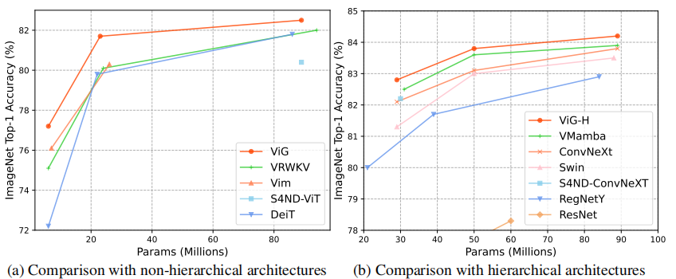
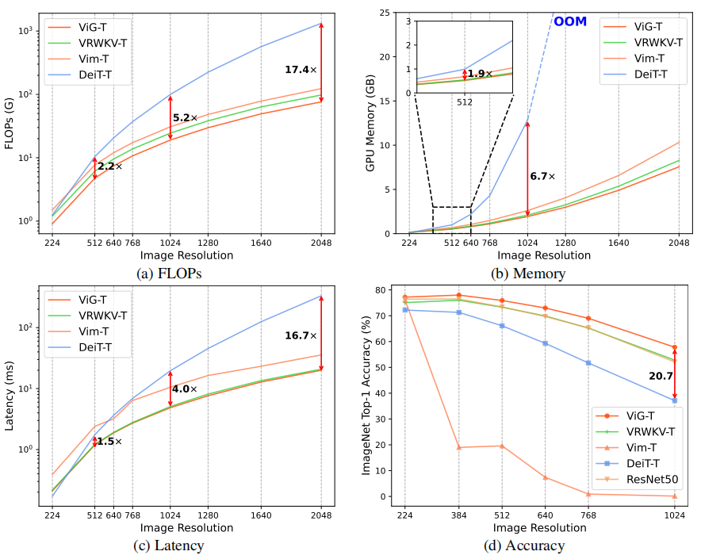

<div align="center">
<h1>ViG </h1>
<h3>Linear-complexity Visual Sequence Learning with Gated Linear Attention</h3>

[Bencheng Liao](https://github.com/LegendBC)<sup>1,2</sup>, [Xinggang Wang](https://xinggangw.info/)<sup>2 :email:</sup>, [Lianghui Zhu](https://github.com/Unrealluver)<sup>2</sup>, [Qian Zhang](https://scholar.google.com/citations?user=pCY-bikAAAAJ&hl=zh-CN)<sup>3</sup>, [Chang Huang](https://scholar.google.com/citations?user=IyyEKyIAAAAJ&hl=zh-CN)<sup>3</sup>, 
 
<sup>1</sup>  Institute of Artificial Intelligence, HUST, <sup>2</sup>  School of EIC, HUST,  <sup>3</sup> Horizon Robotics

(<sup>:email:</sup>) corresponding author.

ArXiv Preprint ([arXiv 2405.XXXX](https://arxiv.org/abs/2405.XXXX))

</div>


#


### News

* **`May 29th, 2024`:** We released our paper on Arxiv. Code/Models are coming soon. Please stay tuned! ☕️


## Abstract
Recently, linear complexity sequence modeling networks have achieved modeling capabilities similar to Vision Transformers on a variety of computer vision tasks, while using fewer FLOPs and less memory.
However, their advantage in terms of actual runtime speed is not significant. To address this issue, we introduce Gated Linear Attention (GLA) for vision, leveraging its superior hardware-awareness and efficiency. We propose direction-wise gating to capture  1D global context through bidirectional modeling and a 2D gating locality injection to adaptively inject 2D local details into 1D global context. Our hardware-aware implementation further merges forward and backward scanning into a single kernel, enhancing parallelism and reducing memory cost and latency. The proposed model, ViG, offers a favorable trade-off in accuracy, parameters, and FLOPs on ImageNet and downstream tasks, outperforming popular Transformer and CNN-based models. Notably, ViG-S matches DeiT-B's accuracy while using only 27\% of the parameters and 20\% of the FLOPs, running 2$\times$ faster on $224\times224$ images. At $1024\times1024$ resolution, ViG-T uses $5.2\times$ fewer FLOPs, saves 90\% GPU memory, runs $4.8\times$ faster, and achieves 20.7\% higher top-1 accuracy than DeiT-T. These results position ViG as an efficient and scalable solution for visual representation learning.


<div align="center">

</div>


## Quantitative analysis
### Accuracy *vs.* Parameter
<div align="center"><h4>The proposed basic ViG block achieves global receptive field with linear complexity, while the CNN, vanilla softmax attention and window-attention-based blocks cannot.</h4></div>



### Efficiency & Accuracy *vs.* Resolution


## Getting Started
TODO


## Acknowledgements
This code is developed on the top of [Vim](https://github.com/hustvl/Vim), [VMamba](https://github.com/MzeroMiko/VMamba), [VRWKV](https://github.com/OpenGVLab/Vision-RWKV), and [FLA](https://github.com/sustcsonglin/flash-linear-attention). Thanks for their great works.
## Citation
If you find ViG is useful in your research or applications, please consider giving us a star 🌟 and citing it by the following BibTeX entry.

```bibtex
 @article{lanegap,
  title={ViG: Linear-complexity Visual Sequence Learning with Gated Linear Attention},
  author={Bencheng Liao and Xinggang Wang and Lianghui Zhu and Qian Zhang and Chang Huang},
  journal={arXiv preprint arXiv:2405.XXXXX},
  year={2024}
}
```
